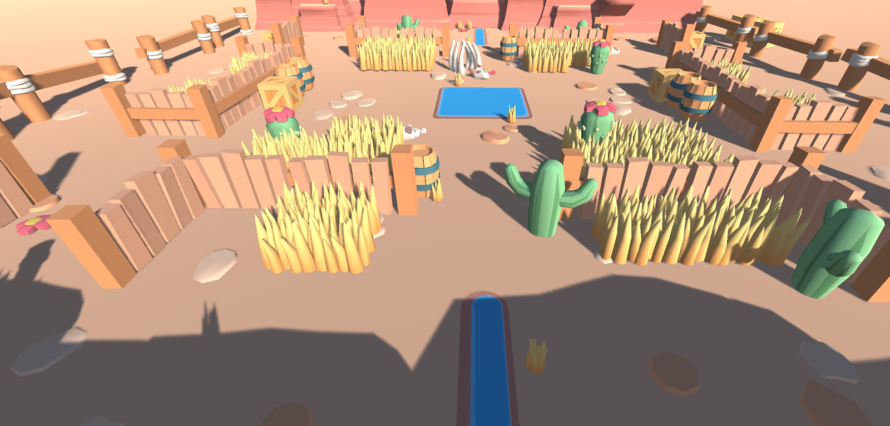

# TestTask2

Тестовое задание. Unity3d Developer

Условия выполнения:

Определить срок, выполнения задания и сообщить об этом (дата и время).
Для выполнения тестового задания необходимо создать проект в GitHub / GitLab / или архив с исходным кодом. После завершения задания отправить ссылку указав время, потраченное на задачу.
Использование чистого C# без Zenject и UniRx фреймворков.
Приблизительное время выполнения задания - не более 8 часов.
Ваше тестовое не будет использоваться нами в коммерческих целях.

Задача: Реализовать гиперказуальную кор-механику на уровне прототипа по краткому описанию (см. Игровой процесс). Обязательно интегрировать в игру модели персонажей и базовые анимации (айдл и ходьба) либо для ГГ либо для ботов (по своему выбору).

Модели и анимации: https://disk.yandex.ru/d/O1pEHS7aUKXJZw

Жанр/сеттинг: Стелс-аркада в ГК-сеттинге вестерна.

Ориентация: вертикальная.

Визуал: 

На что ориентироваться: Механика из Legend of Zelda. https://www.youtube.com/watch?v=jMNLrWYrDeo

-

Механика обнаружения из Hide And Seek

https://play.google.com/store/apps/details?id=com.seenax.HideAndSeek

Игровой процесс.

Игрок управляет персонажем, который скрывается внутри бочки. Управление реализовано с помощью джойстика на экране.

При ходьбе из под бочки высовываются длинные ноги ГГ и он движется, наполовину накрытый бочкой.

Когда игрок останавливается, ГГ присаживается и полностью накрывается бочкой, переходя в стелс-режим.

По локации ходят враги, у которых есть зона обнаружения.

Если ГГ попал в зону обнаружения врага во время ходьбы, враг делает выстрел по ГГ и игрок терпит поражение.

Когда ГГ находится в стелс-режиме (полностью накрыт бочкой), враги игнорируют его.

Игрок должен незаметно пройти от стартовой точки уровня до финальной, минуя пять врагов, которые движутся по разным траекториям.

По желанию.

Добавить механику таймера и реализовать сохранение лучшего результата. Например,

Уровень должен быть пройден не более, чем за 20 секунд.

Должен высвечиваться рекорд прохождения.

Реализовать отображение интерфейса:

Джойстик движения.

Кнопка перезагрузки уровня.

Выпадение попапов победы и поражения.

Бар для таймера с убывающим временем.
